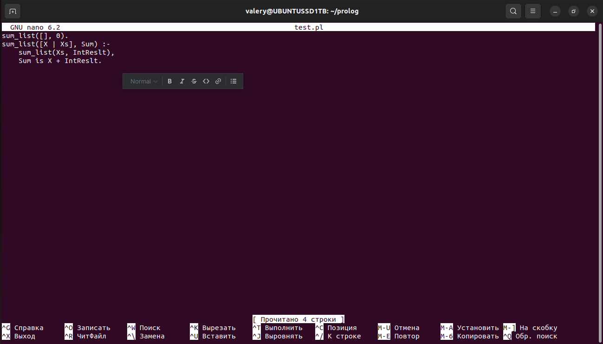
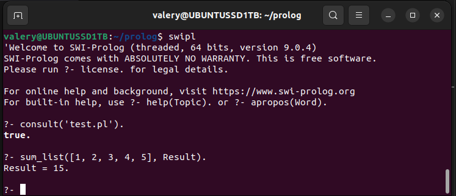

### скрипт суммы чисел списка на языке prolog

###  Предикат, указывающий, что сумма пустого списка равна нулю:
    sum_list([], 0).

### Предикат, рекурсивно вычисляющий сумму чисел из списка, разбиваем список на голову X и хвост Xs, сумма записывается в IntResult, в конце голова складывается с IntResult, что дает сумму всего списка:

    sum_list([X | Xs], Sum) :-
    sum_list(Xs, IntReslt),
        Sum is X + IntReslt.

### для запуска в терминале ubuntu:
1. заходим в директорию, где лежит скрипт - cd ...
2. запускаем swi-prolog - swipl
3. загружаем скрипт - consult('test.pl').
4. запускаем скрипт - sum_list([1, 2, 3, 4, 5], Result).
5. получаем результат Result = ...

